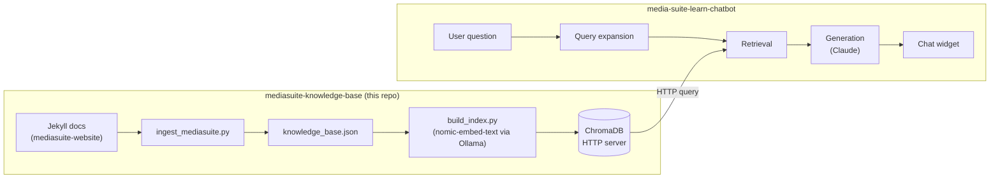

# mediasuite-knowledge-base

Knowledge base infrastructure for the [CLARIAH Media Suite](https://mediasuite.clariah.nl) —
ingests, chunks, embeds, and indexes Media Suite documentation and learning materials
so AI applications can query them via vector search.

Intentionally decoupled from any specific application. The first consumer is
[media-suite-learn-chatbot](https://github.com/roelandordelman/media-suite-learn-chatbot).

---

## Architecture



---

## Content sources

All content comes from [beeldengeluid/mediasuite-website](https://github.com/beeldengeluid/mediasuite-website) (Jekyll/Markdown).

| Collection | Content type | URL base |
|---|---|---|
| `_help` | Help / Documentation | mediasuite.clariah.nl/documentation |
| `_howtos` | How-to Guides | mediasuite.clariah.nl/documentation/howtos |
| `_faq` | FAQ | mediasuite.clariah.nl/documentation/faq |
| `_glossary` | Glossary | mediasuite.clariah.nl/documentation/glossary |
| `_learn_main` | Learn (General) | mediasuite.clariah.nl/learn |
| `_learn_tutorials_tool` | Tool Tutorials | mediasuite.clariah.nl/learn/tool-tutorials |
| `_learn_tutorials_subject` | Subject Tutorials | mediasuite.clariah.nl/learn/subject-tutorials |
| `_learn_tool_criticism` | Tool Criticism | mediasuite.clariah.nl/learn/tool-criticism |
| `_learn_example_projects` | Example Projects | mediasuite.clariah.nl/learn/example-projects |
| `_labo-help` | Labo Help | mediasuite.clariah.nl/labo/documentation |

Planned additions: GitHub Issues, research publications (via DOI), Jupyter notebooks, data platform documentation.

---

## Running the pipeline

```bash
# Install dependencies
pip install -r requirements.txt
ollama pull nomic-embed-text

# 1. Clone the content source
git clone --depth=1 https://github.com/beeldengeluid/mediasuite-website.git /tmp/mediasuite-website

# 2. Ingest → JSON
python pipelines/ingest/ingest_mediasuite.py

# 3. Start ChromaDB server (keep running in a separate terminal)
chroma run --path ./stores/chroma_db

# 4. Embed → ChromaDB
python pipelines/embed/build_index.py
```

All paths and connection details are configured in `config.yaml`.

---

## Chunk schema

```json
{
  "id":                    "collection/slug/chunk_index",
  "title":                 "page title from front matter",
  "section":               "heading the chunk falls under (may be empty)",
  "collection":            "_howtos",
  "content_type":          "How-to Guide",
  "url":                   "https://mediasuite.clariah.nl/documentation/howtos/...",
  "tags":                  ["tag1", "tag2"],
  "author":                "author if present",
  "categories":            ["subject category"],
  "tools_mentioned":       ["Collection Inspector", "Workspace"],
  "collections_mentioned": ["Sound & Vision Archive"],
  "text":                  "[Title — Section]\nThe chunk text...",
  "char_count":            312
}
```

`url` is always preserved — it is what allows applications to deep-link to the relevant source.

List fields (`tags`, `categories`, `tools_mentioned`, `collections_mentioned`) are stored as JSON-encoded strings in ChromaDB and must be decoded with `json.loads()` by the consuming application.

---

## Evaluation

```bash
python evaluate/eval_retrieval.py
python evaluate/eval_retrieval.py --top-k 10
```

Test questions and expected source URLs live in `evaluate/test_questions.yaml`. Add new questions there as the knowledge base grows — never let evaluation be an afterthought.

---

## Project structure

```
mediasuite-knowledge-base/
├── pipelines/
│   ├── ingest/
│   │   └── ingest_mediasuite.py
│   └── embed/
│       └── build_index.py
├── evaluate/
│   ├── eval_retrieval.py
│   └── test_questions.yaml
├── stores/
│   └── chroma_db/          # gitignored — regenerate via pipeline
├── config.yaml
├── requirements.txt
└── knowledge_base.json     # gitignored — generated by ingest
```

---

## How the chatbot connects

```yaml
# in media-suite-learn-chatbot/config.yaml
knowledge_base:
  collection_name: mediasuite
  chroma_host: localhost
  chroma_port: 8000
```
