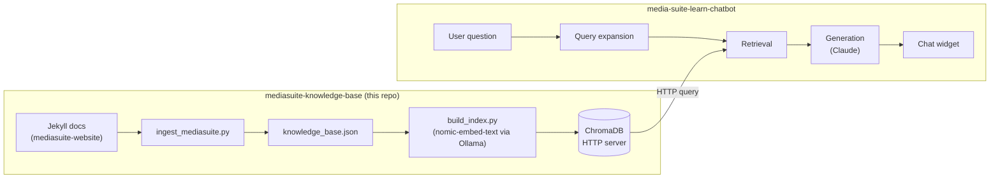

# mediasuite-knowledge-base

Knowledge base infrastructure for the [CLARIAH Media Suite](https://mediasuite.clariah.nl) —
ingests, chunks, embeds, and indexes Media Suite documentation and learning materials
so AI applications can query them via vector search.

Intentionally decoupled from any specific application. The first consumer is
[media-suite-learn-chatbot](https://github.com/roelandordelman/media-suite-learn-chatbot).

---

## Architecture



---

## Content sources

All content comes from [beeldengeluid/mediasuite-website](https://github.com/beeldengeluid/mediasuite-website) (Jekyll/Markdown).

| Collection | Content type | URL base |
|---|---|---|
| `_help` | Help / Documentation | mediasuite.clariah.nl/documentation |
| `_howtos` | How-to Guides | mediasuite.clariah.nl/documentation/howtos |
| `_faq` | FAQ | mediasuite.clariah.nl/documentation/faq |
| `_glossary` | Glossary | mediasuite.clariah.nl/documentation/glossary |
| `_learn_main` | Learn (General) | mediasuite.clariah.nl/learn |
| `_learn_tutorials_tool` | Tool Tutorials | mediasuite.clariah.nl/learn/tool-tutorials |
| `_learn_tutorials_subject` | Subject Tutorials | mediasuite.clariah.nl/learn/subject-tutorials |
| `_learn_tool_criticism` | Tool Criticism | mediasuite.clariah.nl/learn/tool-criticism |
| `_learn_example_projects` | Example Projects | mediasuite.clariah.nl/learn/example-projects |
| `_labo-help` | Labo Help | mediasuite.clariah.nl/labo/documentation |

Planned additions: GitHub Issues, research publications (via DOI), Jupyter notebooks, data platform documentation.

---

## Running the pipeline

```bash
# Install dependencies
pip install -r requirements.txt
ollama pull nomic-embed-text

# 1. Clone the content source
git clone --depth=1 https://github.com/beeldengeluid/mediasuite-website.git /tmp/mediasuite-website

# 2. Ingest → JSON
python pipelines/ingest/ingest_mediasuite.py

# 3. Start ChromaDB server (keep running in a separate terminal)
chroma run --path ./stores/chroma_db

# 4. Embed → ChromaDB
python pipelines/embed/build_index.py
```

All paths and connection details are configured in `config.yaml`.

---

## Chunk schema

```json
{
  "id":                    "collection/slug/chunk_index",
  "title":                 "page title from front matter",
  "section":               "heading the chunk falls under (may be empty)",
  "collection":            "_howtos",
  "content_type":          "How-to Guide",
  "url":                   "https://mediasuite.clariah.nl/documentation/howtos/...",
  "tags":                  ["tag1", "tag2"],
  "author":                "author if present",
  "categories":            ["subject category"],
  "tools_mentioned":       ["Collection Inspector", "Workspace"],
  "collections_mentioned": ["Sound & Vision Archive"],
  "created_date":          "2021-03-15",
  "modified_date":         "2023-11-02",
  "source_commit":         "a3f9b2c",
  "content_hash":          "sha256:e3b0c44...",
  "text":                  "[Title — Section]\nThe chunk text...",
  "char_count":            312
}
```

`url` is always preserved — it is what allows applications to deep-link to the relevant source.

List fields (`tags`, `categories`, `tools_mentioned`, `collections_mentioned`) are stored as JSON-encoded strings in ChromaDB and must be decoded with `json.loads()` by the consuming application.

---

## Chunk metadata, freshness and source persistence

A knowledge base is only as trustworthy as the information it contains — and
information changes. Documentation gets updated, pages move, tools are renamed,
features are added or removed. A chatbot that serves outdated or broken information
to researchers is worse than no chatbot at all, because it creates false confidence.

This raises three interconnected challenges:

**Freshness** — how do we know when a chunk was last updated, and how do we
handle cases where two sources say different things about the same topic? Silently
picking the most recent answer is one option, but surfacing the conflict explicitly
is more honest and more useful to a researcher who needs to trust their sources.

**Drift** — a page can keep its URL but quietly change its content. A chunk that
was accurate when ingested can become misleading without any visible signal. The
knowledge base needs a way to detect when the live source has diverged from what
was ingested, and flag or re-embed those chunks.

**Persistence** — URLs are mutable infrastructure. Pages move, sites get
restructured, URLs break. If the chatbot hands a researcher a dead link, that is
a trust failure. For a prototype this is tolerable; for a production system serving
real researchers it is not. The right solution is a persistent identifier layer —
stable, citable URLs that redirect to wherever the content currently lives,
consistent with how CLARIAH already handles identifiers for datasets.

### Metadata fields

| Field | Source | Purpose |
|---|---|---|
| `id` | generated | unique chunk identifier |
| `title` | front matter | page title |
| `section` | markdown heading | section within page |
| `collection` | Jekyll collection folder | content type grouping |
| `content_type` | config | human-readable type label |
| `url` | derived from file path | live URL on mediasuite.clariah.nl |
| `tags` | front matter | topic tags |
| `author` | front matter | content author |
| `categories` | front matter | subject categories |
| `tools_mentioned` | keyword extraction | Media Suite tools referenced |
| `collections_mentioned` | keyword extraction | Media Suite collections referenced |
| `created_date` | front matter `date` field | original publication date |
| `modified_date` | git log | date of last change to source file |
| `source_commit` | git log | git commit hash at time of ingestion |
| `content_hash` | SHA256 of chunk text | fingerprint for drift detection |
| `char_count` | generated | chunk length in characters |

### Why modification date matters

Documentation goes out of date. When two chunks contain conflicting information
about the same topic, the `modified_date` field allows the system to favour more
recently updated content, or — better — to surface the conflict explicitly to the
researcher so they can judge for themselves:

> "Two sources address this differently. The more recent one (updated 2023) says X.
> An older page (2021) says Y. Check the current documentation to confirm."

### Content drift detection

The `content_hash` field (SHA256 of the chunk text) enables efficient drift
detection on re-ingestion. Rather than re-embedding the entire knowledge base
when the source repository is updated, the pipeline compares hashes and only
re-embeds chunks whose content has actually changed. This keeps re-ingestion
fast as the knowledge base grows.

A future staleness check script will periodically fetch live URLs and flag
chunks where the ingested content no longer matches the live page.

### Source URL persistence — a known limitation

Currently, chunk identity is tied to the source URL. This creates two risks:

- **Link rot** — if a page moves or is removed, the URL the chatbot provides
  to researchers becomes a dead link
- **Content drift** — a page can keep its URL but change its content, making
  the chunk silently misleading

For the current prototype phase this is acceptable. For a production system,
the right solution is a **persistent identifier layer**: all chatbot-facing URLs
should go through a stable redirect layer that decouples the public URL from the
internal location. If a page moves, the redirect is updated rather than the
knowledge base.

```
https://mediasuite.clariah.nl/doc/annotate   ← stable PID-like URL
    → redirects to current live page
```

This is consistent with how CLARIAH already handles persistent identifiers for
datasets, and the same thinking should apply to documentation pages.

### Knowledge base versioning

Each ingestion run should be tagged with a date and the source commit it was
built from. The `source_commit` field on every chunk provides traceability back
to the exact state of the `mediasuite-website` repository at ingestion time.
Future versions of the pipeline will maintain a version log:

```
kb-version  ingested-at           source-commit  chunk-count
v0.1        2026-04-25            a3f9b2c        10719
v0.2        2026-05-10            d8e1f4a        11203
```

This supports research provenance — a researcher can record which version of the
knowledge base was active when they used the chatbot.

---

## Evaluation

```bash
python evaluate/eval_retrieval.py
python evaluate/eval_retrieval.py --top-k 10
```

Test questions and expected source URLs live in `evaluate/test_questions.yaml`. Add new questions there as the knowledge base grows — never let evaluation be an afterthought.

---

## Project structure

```
mediasuite-knowledge-base/
├── pipelines/
│   ├── ingest/
│   │   └── ingest_mediasuite.py
│   └── embed/
│       └── build_index.py
├── evaluate/
│   ├── eval_retrieval.py
│   └── test_questions.yaml
├── stores/
│   └── chroma_db/          # gitignored — regenerate via pipeline
├── config.yaml
├── requirements.txt
└── knowledge_base.json     # gitignored — generated by ingest
```

---

## How the chatbot connects

```yaml
# in media-suite-learn-chatbot/config.yaml
knowledge_base:
  collection_name: mediasuite
  chroma_host: localhost
  chroma_port: 8001
```

---

## Roadmap

This roadmap tracks the development of the knowledge base from local prototype
to production-ready CLARIAH infrastructure. It is ordered from simple to
advanced, and is deliberately kept as a living document — items are added,
reprioritised, or reframed based on what we learn along the way. Completed
items are kept visible so the learning journey is traceable.

If something turns out to be harder, less useful, or superseded by a better
approach than expected, that is noted inline rather than silently removed.

### Phase 1 — Local prototype ✓

The goal of this phase is a working end-to-end RAG pipeline running locally,
good enough to test retrieval quality and answer quality on real questions.

- [x] Ingest Media Suite website content from `beeldengeluid/mediasuite-website`
- [x] Parse Jekyll/Markdown front matter — preserve title, section, collection, URL
- [x] Deduplicate chunks across collections (cross-posted tutorials)
- [x] Embed chunks using `nomic-embed-text` via Ollama
- [x] Store vectors and metadata in ChromaDB
- [x] Serve ChromaDB over HTTP (decouple knowledge base from application)
- [x] Build retrieval evaluation script with Hit@10 and MRR metrics
- [x] Structured test question set with `answerable` / `partial` / `gap` categories
- [x] Extract `tools_mentioned` and `collections_mentioned` per chunk
- [x] Add `modified_date` and `source_commit` from git log per source file
- [x] Add `content_hash` (SHA256) per chunk for drift detection
- [x] Separate knowledge base repo from chatbot application repo
- [x] Knowledge base connects to chatbot via HTTP only — no shared filesystem

### Phase 2 — Knowledge base enrichment

The goal of this phase is to expand the knowledge base with additional sources
that make it significantly more useful to researchers.

- [ ] Ingest GitHub Issues from `beeldengeluid/mediasuite-website` as authentic Q&A
- [ ] Ingest research publications via DOIs
  - [ ] Use Unpaywall API to find open access PDFs
  - [ ] Filter for Media Suite relevance (two-pass: abstract scan → passage extraction)
  - [ ] Generate per-paper summary of how the Media Suite was used
  - [ ] Tag as `content_type: Research Example` with DOI as persistent identifier
- [ ] Ingest Jupyter notebook markdown cells from Media Suite example notebooks
- [ ] Ingest data platform documentation from `data.beeldengeluid.nl`
- [ ] Ingest workshop and tutorial materials (PDFs, slide decks)
- [ ] Expand `known_tools` and `known_collections` lists in `config.yaml` based on corpus analysis
- [ ] Validate entity extraction quality — check `tools_mentioned` / `collections_mentioned` for false positives

### Phase 3 — Retrieval quality improvements

The goal of this phase is to improve retrieval precision and recall based on
what we learn from evaluation and real researcher questions.

- [ ] Expand test question set to 30+ questions across all three categories
- [ ] Add end-to-end answer quality evaluation in the chatbot repo
- [ ] Implement recency boost — favour recently modified chunks when scores are close
- [ ] Implement staleness check — periodically compare live page content against ingested chunks
- [ ] Add re-ingestion pipeline that only re-embeds changed chunks (using `content_hash`)
- [ ] Investigate query expansion / rewriting to address vocabulary mismatch
  - [ ] Evaluate HyDE (Hypothetical Document Embedding) approach
  - [ ] Evaluate simple LLM-based query rewriting before embedding
- [ ] Tune chunk size and overlap based on retrieval evaluation results
- [ ] Investigate re-ranking — use a cross-encoder to re-rank top-k results before generation

### Phase 4 — Structured data and knowledge graph

The goal of this phase is to add a structured layer alongside the vector store,
enabling precise relational queries that semantic search cannot answer well.

- [ ] Define entity model: Tool, Collection, Tutorial, ResearchExample, Researcher
- [ ] Extract entities and relations from chunks using local LLM
- [ ] Build RDF graph from extracted entities
- [ ] Store in Apache Jena Fuseki triplestore with SPARQL endpoint
- [ ] Align entity vocabulary with existing CLARIAH linked data vocabularies
- [ ] Implement hybrid retrieval — combine vector search and SPARQL for complex queries
- [ ] Evaluate when graph retrieval outperforms vector retrieval and vice versa
- [ ] Export knowledge graph as Turtle/RDF for reuse beyond the chatbot

### Phase 5 — Source persistence and provenance

The goal of this phase is to make the knowledge base trustworthy enough for
production use, where researchers need to cite sources and rely on stable links.

- [ ] Add version log — record each ingestion run with date, source commit, chunk count
- [ ] Implement persistent URL redirect layer for all chatbot-facing source URLs
- [ ] Raise documentation PID question within CLARIAH infrastructure team
- [ ] Implement per-chunk provenance metadata suitable for research citation
- [ ] Add API endpoint to query knowledge base version history
- [ ] Define deprecation policy for outdated chunks

### Phase 6 — User evaluation and iteration

The goal of this phase is to put the system in front of real researchers and
use what we learn to drive further development.

- [ ] Define evaluation methodology — what does "good" look like for researchers?
- [ ] Recruit a small group of Media Suite researchers for informal testing
- [ ] Collect and analyse real questions asked to the chatbot
- [ ] Compare real questions against test question set — identify gaps
- [ ] Iterate on knowledge base content based on evaluation findings
- [ ] Iterate on retrieval and generation based on evaluation findings
- [ ] Document findings in a short report for CLARIAH

### Phase 7 — Expansion to CLARIAH

The goal of this phase is to generalise the infrastructure beyond the Media
Suite to serve the broader CLARIAH research community.

- [ ] Assess which CLARIAH tools and collections would benefit from the same approach
- [ ] Abstract ingest pipeline to support multiple source repositories
- [ ] Define shared vocabulary and entity model across CLARIAH tools
- [ ] Rename / restructure as `clariah-knowledge-base` or integrate with existing infrastructure
- [ ] Explore integration with CLARIAH FAIR data infrastructure
- [ ] Publish the pipeline and methodology as a reusable open source component

### Learning log

This section captures things that turned out differently than expected.
Updated as the project progresses.

| Date | Finding | Impact on roadmap |
|---|---|---|
| 2026-04-25 | 43% → 86% Hit@10 jump came from fixing test questions, not the retrieval system | Evaluation quality matters as much as retrieval quality — added emphasis on test set curation |
| 2026-04-25 | ChromaDB metadata only supports scalar values — lists must be JSON-encoded | Added note to chunk schema documentation; chatbot query layer must `json.loads()` list fields |
| 2026-04-25 | Deduplication improved MRR from 0.333 to 0.357 — modest but meaningful | Post-retrieval deduplication by URL confirmed as standard step |
| 2026-04-25 | LLM answer quality poor even when retrieval was correct | Retrieval and generation are separate failure modes — need separate evaluation |
