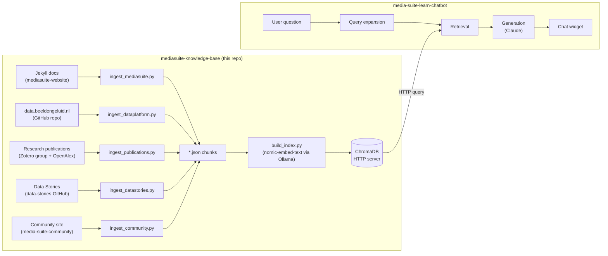

# mediasuite-knowledge-base

Knowledge base infrastructure for the [CLARIAH Media Suite](https://mediasuite.clariah.nl) —
ingests, chunks, embeds, and indexes Media Suite documentation and learning materials
so AI applications can query them via vector search.

Intentionally decoupled from any specific application. The first consumer is
[media-suite-learn-chatbot](https://github.com/roelandordelman/media-suite-learn-chatbot).

---

## Architecture



---

## Content sources

### Media Suite website
From [beeldengeluid/mediasuite-website](https://github.com/beeldengeluid/mediasuite-website) (Jekyll/Markdown):

| Collection | Content type | URL base |
|---|---|---|
| `_help` | Help / Documentation | mediasuite.clariah.nl/documentation |
| `_howtos` | How-to Guides | mediasuite.clariah.nl/documentation/howtos |
| `_faq` | FAQ | mediasuite.clariah.nl/documentation/faq |
| `_glossary` | Glossary | mediasuite.clariah.nl/documentation/glossary |
| `_learn_main` | Learn (General) | mediasuite.clariah.nl/learn |
| `_learn_tutorials_tool` | Tool Tutorials | mediasuite.clariah.nl/learn/tool-tutorials |
| `_learn_tutorials_subject` | Subject Tutorials | mediasuite.clariah.nl/learn/subject-tutorials |
| `_learn_tool_criticism` | Tool Criticism | mediasuite.clariah.nl/learn/tool-criticism |
| `_learn_example_projects` | Example Projects | mediasuite.clariah.nl/learn/example-projects |
| `_labo-help` | Labo Help | mediasuite.clariah.nl/labo/documentation |
| `_release-notes` | Release Notes | mediasuite.clariah.nl/documentation/release-notes |

### Data platform
From [beeldengeluid/data.beeldengeluid.nl](https://github.com/beeldengeluid/data.beeldengeluid.nl): collection documentation and API documentation from `data.beeldengeluid.nl`.

### Research publications
From [Zotero group 2288915](https://www.zotero.org/groups/2288915) (the Media Suite community publications list), enriched via OpenAlex for abstracts and open-access PDFs. Each paper gets a generated summary of how the Media Suite was used, chunked alongside abstract and relevant extracted passages. High-relevance papers not in Zotero can be added via `supplementary_dois` in `config.yaml`.

### Data Stories
From [beeldengeluid/data-stories](https://github.com/beeldengeluid/data-stories) — enhanced publication format combining Jupyter Notebook analyses with narrative. 7 English stories on quantitative Media Suite research (gender representation, TV news, election coverage, pandemic media). Dutch-only stories excluded. Each story is chunked by section; bilingual stories prefer the `index.en.md` source.

### Community site (SANE documentation)
From [roelandordelman/media-suite-community](https://github.com/roelandordelman/media-suite-community) — SANE (Secure Analysis Environment) workflow documentation and available NISV collection descriptions. Covers how researchers work with sensitive audiovisual data that cannot leave the secure environment.

---

## Running the pipeline

```bash
# Install dependencies
pip install -r requirements.txt
ollama pull nomic-embed-text

# Start ChromaDB server (keep running in a separate terminal)
chroma run --path ./stores/chroma_db

# 1. Clone the content sources
# Use full clone (no --depth) to get accurate per-file modified_date from git log.
git clone https://github.com/beeldengeluid/mediasuite-website.git /tmp/mediasuite-website
git clone https://github.com/beeldengeluid/data.beeldengeluid.nl.git /tmp/data.beeldengeluid.nl
git clone --depth=1 https://github.com/beeldengeluid/data-stories.git /tmp/data-stories
git clone --depth=1 https://github.com/roelandordelman/media-suite-community.git /tmp/media-suite-community

# 2. Ingest → JSON  (run all; each produces its own JSON file)
python pipelines/ingest/ingest_mediasuite.py
python pipelines/ingest/ingest_dataplatform.py
python pipelines/ingest/ingest_publications.py   # fetches Zotero + OpenAlex; see flags below
python pipelines/ingest/ingest_datastories.py
python pipelines/ingest/ingest_community.py

# 3. Embed → ChromaDB  (incremental — skips already-indexed chunks)
python pipelines/embed/build_index.py --input knowledge_base.json
python pipelines/embed/build_index.py --input data_platform.json
python pipelines/embed/build_index.py --input publications.json
python pipelines/embed/build_index.py --input data_stories.json
python pipelines/embed/build_index.py --input community.json
```

**Publications pipeline flags:**
```bash
python pipelines/ingest/ingest_publications.py --help
  --no-pdf        skip PDF download/extraction (abstract-only mode)
  --no-generate   skip LLM summary generation
  --refresh       re-fetch Zotero + OpenAlex data (clears API caches)
  --limit N       process only the first N papers (for testing)
```

To rebuild the index from scratch (e.g. after a schema change):

```bash
# Stop the chroma server, then:
rm -rf ./stores/chroma_db
chroma run --path ./stores/chroma_db   # restart in a separate terminal
python pipelines/embed/build_index.py --input knowledge_base.json
python pipelines/embed/build_index.py --input data_platform.json
python pipelines/embed/build_index.py --input publications.json
python pipelines/embed/build_index.py --input data_stories.json
python pipelines/embed/build_index.py --input community.json
```

All paths and connection details are configured in `config.yaml`.

---

## Evaluation

A knowledge base is only useful if it retrieves the right information. Evaluation
is therefore not an afterthought — it is built into the pipeline from the start
and run every time the knowledge base changes significantly.

### Two levels of evaluation

**Retrieval evaluation** (this repo) answers: *did we get the right chunks back?*
It tests the embedding model, chunking strategy, and vector store in isolation,
without involving the chatbot or the language model. This is the fastest feedback
loop and the first thing to check when something seems wrong.

**Answer evaluation** (in the chatbot repo) answers: *did we say the right thing?*
It tests the full RAG pipeline end to end — retrieval, prompt construction, and
generation. This is slower to run and harder to score, but ultimately what
researchers experience.

### Running retrieval evaluation

```bash
# make sure the ChromaDB server is running first
python3 evaluate/eval_retrieval.py

# run only a specific category of questions
python3 evaluate/eval_retrieval.py --category answerable
python3 evaluate/eval_retrieval.py --category gap
```

### The test question set

Test questions are stored in `evaluate/test_questions.yaml` — a plain YAML file
that is easy to edit without touching any code. Each question has four fields:

```yaml
- question: "How do I create an annotation?"
  category: answerable
  expected_urls:
    - https://mediasuite.clariah.nl/documentation/howtos/annotate
  notes: "Core how-to, should always pass"
```

**Three categories of questions:**

| Category | Meaning | Expected result |
|---|---|---|
| `answerable` | Content exists, URL is known | Should PASS — a FAIL means retrieval needs fixing |
| `partial` | Content exists but is spread across pages, or answer is implicit | May FAIL — tracked for improvement over time |
| `gap` | Content does not yet exist in the knowledge base | Should FAIL — an unexpected PASS is a warning sign |

The `gap` category is particularly important: it turns known content gaps into a
concrete, trackable roadmap. Every time new content is added to the knowledge base,
re-running the evaluation shows which gap questions have been resolved.

### Metrics reported

- **Hit@10** — the proportion of questions where the correct source URL appears
  somewhere in the top 10 retrieved chunks. The primary metric.
- **MRR** (Mean Reciprocal Rank) — rewards finding the right answer higher up
  in the results. A score of 1.0 means the correct URL was always the top result.
- Results are broken down by category so retrieval failures and known gaps are
  not conflated.
- Retrieved URLs are deduplicated — only the highest-scoring chunk per source URL
  counts, so the top-10 represents 10 distinct pages rather than 10 chunks from
  the same page.

### Results

**v0.1, April 2026** (Media Suite website only, 7 questions):
```
Hit@10:  6/7  (86%)    MRR: 0.71
```
The jump from an initial 43% to 86% came almost entirely from correcting the
expected URLs in the test set rather than from changes to the retrieval system.
This was an early lesson: **evaluation quality matters as much as retrieval
quality**.

**v0.2, April 2026** (+ data platform + release notes, 35 questions):
```
Hit@10:  25/26  (96%)   MRR: 0.688
```

**v0.3, April 2026** (+ research publications, Zenodo, chunk_title_overrides, 35 questions / 27 scored):
```
Hit@10:  26/27  (96%)   MRR: 0.673
2,181 total chunks across mediasuite docs, data platform, and 52 publications
```
One known failure: "What is the GTAA?" — short "What is X?" questions embed
close to tutorial introductions rather than the reference page. Tracked in
`test_questions.yaml`.

**v0.4, April 2026** (+ data stories + SANE community docs, 37 scored questions):
```
Hit@10:  28/31  (90%)   MRR: 0.634
2,568 total chunks across 5 sources
```
Three failures: (1) "Has the Media Suite been used for quantitative analysis of television news?" — data stories are narrative/result-focused; the phrase "quantitative analysis" doesn't appear prominently in chunk bodies; (2) "How can I use SANE?" — acronym embeds as the English adjective; descriptive phrasing retrieves correctly; (3) "What is the GTAA?" — persistent known failure. The MRR drop from v0.3 reflects the new harder questions added to the test set rather than a regression in retrieval quality.

### Expanding the test set

The test set should grow alongside the knowledge base. Good sources for new
test questions:

- Real questions asked by researchers using the chatbot (once deployed)
- Questions that reveal content gaps — add as `gap` questions immediately,
  promote to `answerable` once the content is added
- Edge cases: multilingual questions, very specific technical questions,
  questions that combine multiple topics

Aim for at least 30 `answerable` questions before treating the Hit@10 score
as statistically meaningful. With 7 questions, a single failure moves the
score by 14 percentage points.

### A note on gap questions and hallucination

If a `gap` question unexpectedly passes, investigate before celebrating.
There are two possible explanations:

1. The content was added to the knowledge base and the test should be promoted
   to `answerable` — good.
2. The language model is generating a plausible-sounding answer from unrelated
   chunks rather than genuinely retrieving relevant content — this is
   hallucination and needs to be caught.

The retrieval evaluation alone cannot distinguish between these cases. End-to-end
answer evaluation in the chatbot repo is needed to catch hallucination.

---

## Chunk schema

```json
{
  "id":                    "collection/slug/chunk_index",
  "title":                 "page title from front matter",
  "section":               "heading the chunk falls under (may be empty)",
  "collection":            "_howtos",
  "content_type":          "How-to Guide",
  "url":                   "https://mediasuite.clariah.nl/documentation/howtos/...",
  "tags":                  ["tag1", "tag2"],
  "author":                "author if present",
  "categories":            ["subject category"],
  "tools_mentioned":       ["Collection Inspector", "Workspace"],
  "collections_mentioned": ["Sound & Vision Archive"],
  "created_date":          "2021-03-15",
  "modified_date":         "2023-11-02",
  "source_commit":         "a3f9b2c",
  "content_hash":          "sha256:e3b0c44...",
  "text":                  "[Title — Section]\nThe chunk text...",
  "char_count":            312
}
```

`url` is always preserved — it is what allows applications to deep-link to the relevant source.

List fields (`tags`, `categories`, `tools_mentioned`, `collections_mentioned`) are stored as JSON-encoded strings in ChromaDB and must be decoded with `json.loads()` by the consuming application.

---

## Chunk metadata, freshness and source persistence

A knowledge base is only as trustworthy as the information it contains — and
information changes. Documentation gets updated, pages move, tools are renamed,
features are added or removed. A chatbot that serves outdated or broken information
to researchers is worse than no chatbot at all, because it creates false confidence.

This raises three interconnected challenges:

**Freshness** — how do we know when a chunk was last updated, and how do we
handle cases where two sources say different things about the same topic? Silently
picking the most recent answer is one option, but surfacing the conflict explicitly
is more honest and more useful to a researcher who needs to trust their sources.

**Drift** — a page can keep its URL but quietly change its content. A chunk that
was accurate when ingested can become misleading without any visible signal. The
knowledge base needs a way to detect when the live source has diverged from what
was ingested, and flag or re-embed those chunks.

**Persistence** — URLs are mutable infrastructure. Pages move, sites get
restructured, URLs break. If the chatbot hands a researcher a dead link, that is
a trust failure. For a prototype this is tolerable; for a production system serving
real researchers it is not. The right solution is a persistent identifier layer —
stable, citable URLs that redirect to wherever the content currently lives,
consistent with how CLARIAH already handles identifiers for datasets.

### Metadata fields

| Field | Source | Purpose |
|---|---|---|
| `id` | generated | unique chunk identifier |
| `title` | front matter | page title |
| `section` | markdown heading | section within page |
| `collection` | Jekyll collection folder | content type grouping |
| `content_type` | config | human-readable type label |
| `url` | derived from file path | live URL on mediasuite.clariah.nl |
| `tags` | front matter | topic tags |
| `author` | front matter | content author |
| `categories` | front matter | subject categories |
| `tools_mentioned` | keyword extraction | Media Suite tools referenced |
| `collections_mentioned` | keyword extraction | Media Suite collections referenced |
| `created_date` | front matter `date` field | original publication date |
| `modified_date` | git log | date of last change to source file |
| `source_commit` | git log | git commit hash at time of ingestion |
| `content_hash` | SHA256 of chunk text | fingerprint for drift detection |
| `char_count` | generated | chunk length in characters |

### Why modification date matters

Documentation goes out of date. When two chunks contain conflicting information
about the same topic, the `modified_date` field allows the system to favour more
recently updated content, or — better — to surface the conflict explicitly to the
researcher so they can judge for themselves:

> "Two sources address this differently. The more recent one (updated 2023) says X.
> An older page (2021) says Y. Check the current documentation to confirm."

### Content drift detection

The `content_hash` field (SHA256 of the chunk text) enables efficient drift
detection on re-ingestion. Rather than re-embedding the entire knowledge base
when the source repository is updated, the pipeline compares hashes and only
re-embeds chunks whose content has actually changed. This keeps re-ingestion
fast as the knowledge base grows.

A future staleness check script will periodically fetch live URLs and flag
chunks where the ingested content no longer matches the live page.

### Source URL persistence — a known limitation

Currently, chunk identity is tied to the source URL. This creates two risks:

- **Link rot** — if a page moves or is removed, the URL the chatbot provides
  to researchers becomes a dead link
- **Content drift** — a page can keep its URL but change its content, making
  the chunk silently misleading

For the current prototype phase this is acceptable. For a production system,
the right solution is a **persistent identifier layer**: all chatbot-facing URLs
should go through a stable redirect layer that decouples the public URL from the
internal location. If a page moves, the redirect is updated rather than the
knowledge base.

```
https://mediasuite.clariah.nl/doc/annotate   ← stable PID-like URL
    → redirects to current live page
```

This is consistent with how CLARIAH already handles persistent identifiers for
datasets, and the same thinking should apply to documentation pages.

### Knowledge base versioning

Each ingestion run should be tagged with a date and the source commit it was
built from. The `source_commit` field on every chunk provides traceability back
to the exact state of the `mediasuite-website` repository at ingestion time.
Future versions of the pipeline will maintain a version log:

```
kb-version  ingested-at           source-commit  chunk-count
v0.1        2026-04-25            a3f9b2c        10719
v0.2        2026-05-10            d8e1f4a        11203
```

This supports research provenance — a researcher can record which version of the
knowledge base was active when they used the chatbot.

---

## Project structure

```
mediasuite-knowledge-base/
├── pipelines/
│   ├── ingest/
│   │   ├── ingest_mediasuite.py      # mediasuite-website → knowledge_base.json
│   │   ├── ingest_dataplatform.py    # data.beeldengeluid.nl → data_platform.json
│   │   ├── ingest_publications.py    # Zotero + OpenAlex + PDFs → publications.json
│   │   ├── ingest_datastories.py     # data-stories repo → data_stories.json
│   │   ├── ingest_community.py       # media-suite-community → community.json
│   │   └── ingest_local_docs.py      # local PDFs → local_docs.json (for non-public docs)
│   └── embed/
│       └── build_index.py            # JSON chunks → ChromaDB (incremental)
├── evaluate/
│   ├── eval_retrieval.py
│   └── test_questions.yaml
├── stores/
│   └── chroma_db/          # gitignored — regenerate via pipeline
├── config.yaml
├── requirements.txt
├── knowledge_base.json     # gitignored — generated by ingest_mediasuite.py
├── data_platform.json      # gitignored — generated by ingest_dataplatform.py
├── publications.json       # gitignored — generated by ingest_publications.py
├── data_stories.json       # gitignored — generated by ingest_datastories.py
└── community.json          # gitignored — generated by ingest_community.py
```

---

## How the chatbot connects

```yaml
# in media-suite-learn-chatbot/config.yaml
knowledge_base:
  collection_name: mediasuite
  chroma_host: localhost
  chroma_port: 8001
```

---

## Entity model and vocabulary

The knowledge base is designed to support a structured data layer (Phase 4)
alongside the vector store. This section documents the entity model and
vocabulary alignment so that Phase 3 preparation work builds toward a coherent
Phase 4 graph.

### The problem

The word "tool" is overloaded in research infrastructure. The Media Suite is
simultaneously a research environment (a hosted platform), a bundle of
user-facing functionalities (Search Tool, Annotation Tool…), a consumer of
underlying infrastructure services (ASR, Computer Vision), and a participant in
cross-environment research workflows (data registry → Media Suite → publication
platform). Treating all of these as "tools" collapses distinctions that matter
both for retrieval and for alignment with CLARIAH infrastructure vocabularies.

### Five entity types

| Entity type | What it describes | Media Suite example |
|---|---|---|
| `ResearchEnvironment` | A hosted platform that bundles tools and collection access | The Media Suite |
| `ComponentTool` | A user-facing functionality within an environment, directly operated by researchers | Search Tool, Annotation Tool, Compare Tool |
| `InfrastructureService` | An underlying technical service; researchers consume its outputs, not the service itself | ASR, Computer Vision / VisXP |
| `Workflow` | An ordered sequence of tool uses, within or across environments | search → annotate → export → publish to Zenodo |
| `DataProduct` | A collection, enrichment output, or intermediate research artifact | Sound & Vision Archive, ASR transcripts, annotation sets |

### Vocabulary alignment

| Vocabulary | Namespace | Used for |
|---|---|---|
| schema.org | `schema:` | Core software and resource properties |
| CodeMeta | `codemeta:` | Software development metadata |
| softwaretypes | `softwaretypes:` (`w3id.org/software-types`) | Tool type classification |
| softwareiodata | `softwareiodata:` (`w3id.org/software-iodata`) | Input/output data type descriptions |
| TaDiRaH | `tadirah:` (`vocabs.dariah.eu/tadirah`) | Research activities (Searching, Annotating, Comparing…) |
| DCAT | `dcat:` | Dataset and collection descriptions |
| GTAA | — | Subject terms for audiovisual collections (aligns with `data.beeldengeluid.nl`) |
| PROV-O | `prov:` | Workflow provenance and step ordering |
| Custom | `clariah:` | `ResearchEnvironment`, `InfrastructureService`, `deploysService`, `enriches` |

Two custom terms are needed because no existing vocabulary covers the
distinction between a research platform and the tools or infrastructure services
it bundles. These are candidates for contribution to the tools.clariah.nl
vocabulary stack, since other CLARIAH infrastructures face the same modelling
problem.

### Relationships

```
ResearchEnvironment
  ├── schema:hasPart ──────────────► ComponentTool
  │                                       ├── tadirah:researchActivity ──► tadirah:Searching etc.
  │                                       ├── softwareiodata:hasInput ───► DataProduct
  │                                       └── softwareiodata:hasOutput ──► DataProduct
  └── clariah:deploysService ───────► InfrastructureService
                                          ├── softwareiodata:hasInput ───► DataProduct (raw media)
                                          ├── softwareiodata:hasOutput ──► DataProduct (transcripts)
                                          └── clariah:enriches ──────────► dcat:Dataset (collection)

Workflow
  └── schema:step (ordered) ────────► WorkflowStep
                                          ├── schema:instrument ─────────► ComponentTool (or external)
                                          ├── clariah:researchActivity ──► tadirah:Concept
                                          └── schema:result ─────────────► DataProduct
```

### Turtle sketch

```turtle
@prefix clariah:        <https://w3id.org/clariah/vocab#> .
@prefix ms:             <https://mediasuite.clariah.nl/vocab#> .
@prefix schema:         <http://schema.org/> .
@prefix tadirah:        <https://vocabs.dariah.eu/tadirah/> .
@prefix softwareiodata: <https://w3id.org/software-iodata#> .
@prefix dcat:           <http://www.w3.org/ns/dcat#> .

# Research environment
ms:MediaSuite a schema:WebApplication, clariah:ResearchEnvironment ;
    schema:name "CLARIAH Media Suite" ;
    schema:url <https://mediasuite.clariah.nl> ;
    schema:hasPart ms:SearchTool, ms:AnnotationTool, ms:CompareTool ;
    clariah:deploysService ms:ASRService, ms:ComputerVisionService .

# Component tool
ms:SearchTool a schema:WebApplication, clariah:ComponentTool ;
    schema:name "Search Tool" ;
    schema:isPartOf ms:MediaSuite ;
    tadirah:researchActivity tadirah:Searching, tadirah:Browsing ;
    softwareiodata:hasInput ms:AudiovisualCollection ;
    softwareiodata:hasOutput ms:SearchResult .

# Infrastructure service
ms:ASRService a schema:SoftwareApplication, clariah:InfrastructureService ;
    schema:name "Automatic Speech Recognition" ;
    softwareiodata:hasInput ms:AudioRecording ;
    softwareiodata:hasOutput ms:Transcript ;
    clariah:enriches <https://data.beeldengeluid.nl/datasets/nisv-media-catalog> .

# Cross-environment workflow (drawn from gender data story)
ms:GenderWorkflow a schema:HowTo ;
    schema:name "Gender representation analysis using Media Suite and SANE" ;
    schema:step ms:GWStep1, ms:GWStep2, ms:GWStep3, ms:GWStep4 .

ms:GWStep1 a schema:HowToStep ;
    schema:position 1 ;
    schema:instrument ms:SearchTool ;
    clariah:researchActivity tadirah:searching ;
    schema:result ms:SearchResult .

ms:GWStep2 a schema:HowToStep ;
    schema:position 2 ;
    schema:instrument ms:AnnotationTool ;
    clariah:researchActivity tadirah:annotating ;
    schema:result ms:AnnotatedCorpus .

ms:GWStep3 a schema:HowToStep ;
    schema:position 3 ;
    schema:instrument <https://sane.surf.nl/> ;  # external tool
    clariah:researchActivity tadirah:analyzing ;
    schema:result ms:AnalysisDataset .

ms:GWStep4 a schema:HowToStep ;
    schema:position 4 ;
    schema:instrument <https://zenodo.org> ;      # external platform
    clariah:researchActivity tadirah:academicPublishing ;
    schema:result ms:Publication .
```

### Workflow granularity and standards grounding

#### The inflation problem

Defining workflows at the level of individual tool operations ("export annotations",
"share fragment via IIIF") produces a large and fragmented list that does not scale
to CLARIAH as a whole. The risk is dozens of Media Suite-specific micro-workflows
that cannot be compared or composed with workflows from other CLARIAH infrastructures.

#### Two levels of granularity

The solution — grounded in established workflow representation standards — is to
distinguish two levels:

**Top-level workflows** are scoped to a *research method or goal*. A researcher
would say "I am doing X kind of research." They are the right unit for discovery,
comparison, and cross-infrastructure reuse. Examples: "Quantitative analysis of
broadcast media", "Fact-checking research on television talk shows."

**Sub-workflows** are reusable operational patterns that appear as steps inside
top-level workflows. Examples: "Export annotations in FAIR format", "Cite a media
fragment via IIIF." These are modelled as `schema:hasPart` of a top-level workflow
rather than as standalone instances, keeping the top-level list manageable.

#### Standards grounding

The two-level distinction is standard in every major workflow representation system:

| Standard | Relevance | Sub-workflow support |
|---|---|---|
| **Common Workflow Language (CWL)** | De facto standard for computational research workflows; endorsed by EOSC and ReSA | Core feature — a workflow step can itself be a workflow |
| **WFDESC** (Workflow Description Ontology, Taverna/myGrid, Manchester) | Semantic web vocabulary closest to what we are building | Explicit `wfdesc:Workflow` / `wfdesc:Process` composition |
| **PROV-O** (W3C Provenance Ontology) | Used in RO-Crate, the current EOSC standard for packaging research workflows with data | Activity composition via `prov:wasInformedBy` |
| **RO-Crate** (Research Object Crate) | EOSC packaging standard; combines CWL + schema.org + PROV-O | Inherits from CWL |
| **BPMN** (Business Process Model and Notation) | Foundational workflow modelling standard; process/sub-process distinction is textbook | Sub-process is a first-class concept |

The **scoping advice** — that top-level workflows should map to research methods
rather than tool-operation sequences — is a design principle, not a citable standard.
It derives from:
- The TaDiRaH approach (Borek et al., *DHQ* 2016): activity-level taxonomies over
  tool-level ones; activities map to methods, not operations
- Ontology design pattern literature (Gangemi, Presutti): avoiding proliferation
  through appropriate abstraction levels
- Practical experience in DARIAH and CLARIN tool registries, where operation-level
  workflow definitions caused fragmentation and poor cross-infrastructure reusability

There is no single published source that prescribes "scope top-level workflows to
research question types." For CLARIAH documentation, this is best framed as
"aligned with CWL/WFDESC/PROV-O practice; proposed as a design principle for
community discussion."

#### Implications for CLARIAH infrastructure

A CLARIAH-level workflow model should be built on **RO-Crate + CWL + PROV-O**,
which together cover packaging, composition, and provenance. WFDESC adds semantic
richness for the description layer. The `clariah:Workflow` class defined in
`clariah-vocab.ttl` is a lightweight starting point; for production use it should
be aligned with or replaced by these standards.

Key open questions for the CLARIAH roadmap:
- Does SSHOC-NL's DAB/ODRL work include a position on workflow granularity?
  If so, the `clariah:Workflow` model should align with it.
- How should the SSHOC Marketplace workflow model relate to CWL/WFDESC?
  The Marketplace has a workflow concept but its formal grounding is not
  well-documented; clarifying this would benefit interoperability.
- At what level of abstraction should CLARIAH-wide workflow templates be defined —
  research method (generalises across tools), or research environment (Media Suite-
  specific)? The two-level model proposed here answers "both, but keep them separate."

#### TaDiRaH gap: administrative and procedural steps

TaDiRaH 2.0 covers scholarly research activities well but has almost no vocabulary
for the **administrative and procedural steps** that precede or frame analysis in
practice — access requests, data-use agreement signing, environment provisioning,
job submission, output review. These appear concretely in at least two workflows in
this model: `ms:SANEAccessSubWorkflow` (access formalization) and
`ms:OnDemandEnrichmentWorkflow` (job submission and access verification). The closest
available concept is `tadirah:managing`, used as a pragmatic fallback with inline
comments flagging the mismatch.

This is a gap with broad implications: any infrastructure that involves data access
negotiation, ethics review, compute allocation, or onboarding will hit the same
ceiling. It is a candidate for a clariah: extension concept set, alongside
`clariah:Sampling` (Unsworth scholarly primitive not carried into TaDiRaH 2.0) and
visual analysis in the computer vision sense (existing `tadirah:visualAnalysis` has
only a German label and no definition). All three should be proposed to the TaDiRaH
maintainers (github.com/dhtaxonomy/TaDiRAH) as gaps.

#### Modeling convention: steps without `schema:result`

Not every workflow step produces a data artifact. Steps that are administrative
(waiting for approval), infrastructure-side (SURF configures an environment), or
purely transitional carry no `schema:result` in this model. This is intentional —
omitting `schema:result` is a signal that the step is process-oriented rather than
data-producing, not an oversight. Steps with `schema:result` are those where the
researcher produces or receives a named intermediate data product.

#### Where infrastructure ends: the deposit/publication boundary

A recurring modelling decision is where research infrastructure workflows stop and
the broader scholarly publication process begins. The `mediasuite-workflows.ttl`
file makes this boundary explicit:

**In scope — infrastructure-adjacent:**
- **Deposit and cite research output:** archiving a dataset, annotated corpus, or
  computational notebook in a repository (Zenodo, DANS, institutional repo) to obtain
  a persistent identifier (DOI). This is the terminal step modelled in most workflows.
  Citation of the tools, collections, and infrastructure used is part of this step —
  something CLARIAH can actively support by providing citable DOIs and metadata for
  tools and collections.
- **Enhanced publications (Data Stories):** the CLARIAH Data Stories format combines
  computational analysis, visualisation, and narrative within the infrastructure
  ecosystem. This is the closest point where infrastructure and publication overlap —
  provenance and citation are structural, not optional. Represented as `ms:DataStory`
  in the vocabulary.

**Out of scope — scholarly writing workflow:**
- Writing the paper (LaTeX, Overleaf, Word)
- Reference management (Zotero, Mendeley)
- Journal submission and peer review
- Filing at an institutional repository as the *publication* (as opposed to a *data*
  deposit)

This means that the terminal step "Deposit and cite research output" in these workflows
represents the boundary, not the full publication. The `ms:DepositedOutput` data product
type models what the infrastructure produces — a citable, archived artifact — not the
paper that may cite it. This distinction matters for evaluation: a workflow ending in a
deposited corpus is complete from an infrastructure perspective, even if the research
it enables continues beyond it.

**The citation relationship as infrastructure obligation:**
Even out-of-scope scholarly publications maintain a relationship with the infrastructure
through citation. Journals and funders increasingly require citation of datasets and
tools used. CLARIAH can support this by maintaining citable identifiers for all
infrastructure components (tools, collections, APIs) and surfacing them at the right
moment in the workflow — e.g., the "Deposit and cite" step could eventually surface a
pre-filled citation list based on which tools and collections were used in the project.

### Alignment with tools.clariah.nl and the SSHOC Marketplace

The Media Suite is registered in tools.clariah.nl (flows through to the SSHOC
Open Marketplace). The entity model above extends the current registration by
adding `ComponentTool` and `InfrastructureService` descriptions and first-class
`Workflow` objects. The two custom vocabulary terms are candidates for
contribution to the tools.clariah.nl vocabulary so that other CLARIAH
infrastructures facing the same modelling challenge can align.

Workflows referencing tools from multiple environments (Media Suite + SANE +
Zenodo) are exactly what the SSHOC Marketplace workflow model is designed for
— the Turtle representation above can be submitted as a structured workflow
entry there once finalised.

### Collection registries and data currency

#### Relationship between the three registries

Collection descriptions in the knowledge base are drawn from three distinct levels
of a publisher → national registry → VRE stack:

```
data.beeldengeluid.nl / KB / EYE / ...   publisher platforms — the authoritative
                                         source. NISV publishes dataset URIs as
                                         Linked Open Data (e.g. data.beeldengeluid.nl/
                                         id/dataset/0002). NDE harvests FROM here.
        ↓ harvested by
NDE dataset register                     Dutch national registry for cultural heritage
(+ SSHOC Marketplace, CLARIN VLO)        (EU-level registries harvest from NDE).
                                         Authoritative at national level across all
                                         institutions.
        ↓ should be harvested by
mediasuitedata.clariah.nl                Media Suite CKAN registry — which collections
                                         are accessible via the Media Suite specifically.
                                         A filtered, VRE-specific view on a subset of
                                         the national catalog, with Media Suite access
                                         context added.
        ↓ queried by VREs; access negotiated via DAB + ODRL (SSHOC-NL, in development)
ms:MediaSuite / sane.surf.nl             VREs that expose collections to researchers.
```

**Current reality:** `mediasuitedata.clariah.nl` is partly manually maintained and
not fully linked to resource maintainers — some collections were added without a
proper link to the registering institution. The intended direction is to clean this
up and adhere to NDE standards, but this will take time. In `mediasuite-collections.ttl`,
`owl:sameAs` links point to publisher/NDE URIs where confirmed; `[NO_NDE_URI]`
flags collections not yet registered at the national level.

**On `data.beeldengeluid.nl` specifically:** this is NISV's own Linked Open Data
publication platform — the *publisher*, not a registry. The URIs it mints (e.g.
`http://data.beeldengeluid.nl/id/dataset/0002`) are the authoritative identifiers
for NISV collections, used as `owl:sameAs` targets in the entity graph.

#### Keeping entity descriptions current

The Turtle files in `vocab/` are a *view* on information that lives authoritatively
in the registries above. They will lag reality. How to manage this:

| Horizon | Approach |
|---|---|
| Now | Each entity carries `dcterms:modified` (last reviewed) and `dcterms:source` (where to check for updates). Update manually when you know something changed. |
| Phase 4 | When Fuseki is running, updating the graph is a single file reload — no re-embedding needed. The `entity_uri` field in chunks keeps chunks linked to current descriptions. |
| Long term | SPARQL federation against NDE and publisher endpoints at query time, rather than static copies. Requires upstream systems to be stable and consistently available. |
| Long term | NDE change notifications — when the NDE change log mechanism matures, subscribe to it for NISV-related datasets to trigger graph updates automatically. |
| Long term | DAB + ODRL (SSHOC-NL, in development) — when the Data Access Broker is in place, access rights flow from the registry into the VRE; the manual `dcterms:accessRights` strings in the entity graph become redundant. DAB/ODRL also directly impacts workflow execution: step `ms:RDS2` ("Export selection for SANE") is currently a manual bottleneck requiring a data owner representative to transfer the researcher's corpus to SANE. DAB/ODRL would replace or semi-automate this transfer based on machine-readable ODRL policies, with a small manual approval check remaining. This is the most concrete near-term workflow change that DAB/ODRL will enable. |

Collection metadata changes slowly in normal operations, but can change faster
during active registry cleanup or when new collections are onboarded. The `[NO_NDE_URI]`
flags in `mediasuite-collections.ttl` are the most actionable items: each one
represents a collection that should be registered at NDE but isn't yet.

#### Learnings: recommendations for data.beeldengeluid.nl

The following gaps were observed while building `mediasuite-collections.ttl`. They are
noted here as concrete feedback for the NISV data team — improvements that would reduce
manual curation work in this vocabulary and improve interoperability with NDE, SSHOC
Marketplace, and downstream applications.

1. **License information is absent or vague for most datasets.** The datasets overview
   page displays no license information for the majority of collections. Where it appears,
   the wording is generic ("Creative Commons licence, or is already in the Public Domain")
   without specifying the variant (CC0 1.0, CC-BY 4.0, CC-BY-SA 3.0) or linking to a
   CC URI. This forced manual investigation per dataset to determine the applicable license.
   — *Recommendation:* Add an explicit `dcterms:license` URI (e.g.
   `https://creativecommons.org/publicdomain/zero/1.0/`) to every dataset description
   in the LOD. Surface this on the human-facing HTML page as a visible, linked badge.

2. **The LOD description and the HTML page are out of sync on license information.**
   The authoritative LOD entry for Open Beelden (`data.beeldengeluid.nl/id/dataset/0002`)
   does carry `dcterms:license <https://creativecommons.org/publicdomain/zero/1.0/>` —
   this is good practice and was the only confirmed license URI found. However, the
   corresponding HTML dataset page does not display this.
   — *Recommendation:* Render the `dcterms:license` value from the LOD on the HTML page
   so both representations stay in sync.

3. **Natuurbeelden has no confirmed specific license variant.** The dataset page says only
   "Creative Commons license" without specifying which variant. In the vocabulary, CC0 is
   inferred from the parent Open Beelden dataset and flagged as such — but not confirmed.
   — *Recommendation:* Add an explicit `dcterms:license` URI to the Natuurbeelden dataset
   description. If the license differs item-by-item, document the range of variants used.

4. **`dcterms:accessRights` uses prose literals, not standard vocabulary URIs.**
   Across the platform, access rights are described as free text strings rather than using
   the EU Publications Office access-right vocabulary (`PUBLIC`, `RESTRICTED`, `NON_PUBLIC`).
   This is a common shortcut but it prevents machine-readable access classification.
   — *Recommendation:* Use `dcterms:accessRights <http://publications.europa.eu/resource/
   authority/access-right/PUBLIC>` (etc.) for machine-readable classification; carry
   the human-readable detail in `schema:conditionsOfAccess`. This is also required for
   DCAT-AP 3.0 compliance and NDE dataset register ingestion quality.

5. **Most NISV sub-collections are not separately registered in NDE.** Eight of nine NISV
   dataset stubs in the vocabulary carry `[NO_NDE_URI]` — they are not individually
   discoverable via the national registry. Only Open Beelden has a confirmed NDE URI.
   — *Recommendation:* Register each sub-collection (Television Archive, Radio Archive,
   Program Guides, Kijk- & Luistercijfers, etc.) as a separate entry in the NDE dataset
   register, linked to the parent via `dcterms:isPartOf`. This enables NDE-level discovery,
   citation, and change tracking per collection.

---

## Roadmap

This roadmap tracks the development of the knowledge base from local prototype
to production-ready CLARIAH infrastructure. It is ordered from simple to
advanced, and is deliberately kept as a living document — items are added,
reprioritised, or reframed based on what we learn along the way. Completed
items are kept visible so the learning journey is traceable.

If something turns out to be harder, less useful, or superseded by a better
approach than expected, that is noted inline rather than silently removed.

### Phase 1 — Local prototype ✓

The goal of this phase is a working end-to-end RAG pipeline running locally,
good enough to test retrieval quality and answer quality on real questions.

- [x] Ingest Media Suite website content from `beeldengeluid/mediasuite-website`
- [x] Parse Jekyll/Markdown front matter — preserve title, section, collection, URL
- [x] Deduplicate chunks across collections (cross-posted tutorials)
- [x] Fix chunk_text bug — 1-char-step loop was producing 32% junk chunks
- [x] Embed chunks using `nomic-embed-text` via Ollama
- [x] Store vectors and metadata in ChromaDB
- [x] Serve ChromaDB over HTTP (decouple knowledge base from application)
- [x] URL deduplication in retrieval — keep highest-scoring chunk per source URL
- [x] Build retrieval evaluation script with Hit@10 and MRR metrics
- [x] Structured test question set with expected URLs per question
- [x] Extract `tools_mentioned` and `collections_mentioned` per chunk
- [x] Separate knowledge base repo from chatbot application repo
- [x] Knowledge base connects to chatbot via HTTP only — no shared filesystem
- [x] Add `modified_date` and `source_commit` from git log per source file
- [x] Add `content_hash` (SHA256) per chunk for drift detection

### Phase 2 — Knowledge base enrichment

The goal of this phase is to expand the knowledge base with additional sources
that make it significantly more useful to researchers.

- [~] ~~Ingest GitHub Issues from `beeldengeluid/mediasuite-website`~~ — evaluated and skipped; issues are mostly bug reports and dependency bumps, not useful Q&A content
- [x] Ingest `_release-notes/` from `beeldengeluid/mediasuite-website` (24 files, v2–v7.5+) — 88 chunks of version changelogs; good retrieval for collection/feature history questions
- [x] Ingest research publications
  - [x] Use Zotero group 2288915 as primary source (~90 academic papers); OpenAlex for abstract + OA PDF enrichment
  - [x] Filter for Media Suite relevance (two-pass: abstract scan → passage extraction from PDF)
  - [x] Generate per-paper summary of how the Media Suite was used (Mistral via Ollama)
  - [x] `supplementary_dois` config mechanism for high-relevance papers not yet in Zotero
  - [x] Tag as `content_type: Research Publication` with DOI as persistent identifier
- [~] ~~Ingest Jupyter notebook markdown cells from Media Suite example notebooks~~ — evaluated [`beeldengeluid/task-oriented-notebooks`](https://github.com/beeldengeluid/task-oriented-notebooks) (only notebook repo in org); markdown cells are too thin (mostly section headers) for useful chunking; useful for technical users interested in API/SPARQL access but content is better covered by `data.beeldengeluid.nl` API docs; revisit if a richer notebook repo emerges
- [x] Ingest data platform documentation from `data.beeldengeluid.nl` — 12 collection pages + 3 API pages; requires web scraper (`ingest_dataplatform.py`)
- [x] Ingest Zenodo CLARIAH community publications — 72 records checked; tutorial/lesson content excluded as already covered by mediasuite-website ingestion; 5 new DOIs added to `supplementary_dois` (2014–2024 brochure, requirement analysis, DH Benelux paper, ASR workshop, metadata workshop)
- [x] Ingest Data Stories from [beeldengeluid/data-stories](https://github.com/beeldengeluid/data-stories) — 7 English stories, 369 chunks; closes gap on quantitative research use cases; Dutch-only story (mediaoorlog) excluded
- [x] Ingest SANE documentation from [roelandordelman/media-suite-community](https://github.com/roelandordelman/media-suite-community) — 18 chunks covering SANE workflow and available NISV collections; "SANE" acronym vocabulary gap remains (chatbot-side fix needed)
- [~] ~~Ingest internal planning documents (Dutch)~~ — attempted with `ingest_local_docs.py`; the Media Suite Jaarplan 2026 is in Dutch, which the embedding model doesn't bridge to English queries; `ingest_local_docs.py` remains available for future English-language local docs
- [ ] Ingest workshop and tutorial materials (PDFs, slide decks) — partially addressed via Zenodo supplementary_dois
- [ ] Expand `known_tools` and `known_collections` lists in `config.yaml` based on corpus analysis
- [ ] Validate entity extraction quality — check `tools_mentioned` / `collections_mentioned` for false positives

### Phase 3 — Retrieval quality improvements + vocabulary preparation

The goal of this phase is to improve retrieval precision and recall based on
what we learn from evaluation and real researcher questions, and to lay the
vocabulary groundwork for the structured data layer in Phase 4.

**Retrieval quality**

- [x] Expand test question set to 30+ questions across all three categories (35 questions including 8 publication research questions, April 2026)
- [x] `chunk_title_overrides` config mechanism — override the `[Title]` prefix in chunk text for pages where the source title uses different vocabulary than researchers' queries (e.g. "Similarity" → "Similarity — Computer Vision Tool for Visual Image Search")
- [x] All-caps chapter heading detection for PDF section extraction — fixes brochure/report PDFs that use branded chapter names instead of academic section names (abstract, methods, results, etc.)
- [x] Boilerplate detection in PDF extraction — repeated page headers/footers (appearing on >30% of pages) are excluded from both heading detection and chunk content
- [ ] Add end-to-end answer quality evaluation in the chatbot repo
- [ ] Embed tags alongside chunk text in `build_index.py` — tags contain tool/collection names that don't always appear in the chunk body; embedding them would fix residual vocabulary mismatch (e.g. "Computer Vision" tag on Similarity page)
- [ ] Implement recency boost — favour recently modified chunks when scores are close
- [ ] Implement staleness check — periodically compare live page content against ingested chunks
- [ ] Fix incremental re-indexing — `build_index.py` currently skips by chunk ID; changed chunks (e.g. after a title override) must be manually deleted before re-indexing
- [ ] Enrich chunk context prefix with UI tool names to fix vocabulary mismatch (e.g. "Collection Inspector" vs "Inspect tool" in docs)
- [ ] Investigate query expansion / rewriting to address vocabulary mismatch (e.g. "time periods" vs "date intervals")
  - [ ] Evaluate HyDE (Hypothetical Document Embedding) approach
  - [ ] Evaluate simple LLM-based query rewriting before embedding
- [ ] Tune chunk size and overlap based on retrieval evaluation results
- [ ] Investigate re-ranking — use a cross-encoder to re-rank top-k results before generation

**Vocabulary preparation (groundwork for Phase 4)**

- [ ] Define a `clariah-vocab.ttl` file with custom terms not covered by existing vocabularies:
  `clariah:ResearchEnvironment`, `clariah:ComponentTool`, `clariah:InfrastructureService`,
  `clariah:deploysService`, `clariah:enriches` — with `rdfs:label`, `rdfs:comment`, and
  alignment links to `codemeta:`, `softwaretypes:`, `schema:`, `tadirah:`
- [ ] Map `known_tools` list in `config.yaml` to TaDiRaH activity URIs
  (e.g. `SearchTool` → `tadirah:Searching`, `AnnotationTool` → `tadirah:Annotating`) — these
  mappings become the basis for structured activity tagging in Phase 4
- [ ] Write Media Suite entity descriptions in Turtle — one named individual per entity
  (MediaSuite as `clariah:ResearchEnvironment`, each tool as `clariah:ComponentTool`,
  ASR/VisXP as `clariah:InfrastructureService`, collections as `dcat:Dataset`)
- [ ] Write 3–5 representative workflow descriptions in Turtle — e.g. gender analysis
  workflow (search → filter → annotate → export), SANE workflow (access secure environment →
  analyse sensitive material → export results), search-annotate-export workflow
- [ ] Share vocabulary sketch with tools.clariah.nl maintainers for feedback on alignment
  with existing CodeMeta + TaDiRaH + softwaretypes descriptors

### Phase 4 — Structured data and knowledge graph

The goal of this phase is to add a structured layer alongside the vector store,
enabling precise relational queries that semantic search cannot answer well.
The entity model and vocabulary are designed in Phase 3; this phase implements
them in a triplestore and connects the graph layer to retrieval.

The five entity types (see "Entity model and vocabulary" section above):
**ResearchEnvironment** · **ComponentTool** · **InfrastructureService** · **Workflow** · **DataProduct**

- [ ] Set up Apache Jena Fuseki triplestore locally — load `clariah-vocab.ttl` and the
  Media Suite entity Turtle files from Phase 3 into a named graph
- [ ] Add `entity_uri` field to the chunk schema — each chunk carries the URI of the
  entity it describes (e.g. `ms:SearchTool`); enables SPARQL → chunk lookup for
  structural queries ("what tools support annotating?")
- [ ] Write SPARQL queries for structural retrieval patterns:
  - list all `clariah:ComponentTool` instances with their `tadirah:` activity links
  - list all `clariah:InfrastructureService` instances and which tools `clariah:deploysService` them
  - retrieve all `dcat:Dataset` instances accessible via a given tool
  - retrieve all `clariah:Workflow` instances that include a given tool as a step
- [ ] Extract entities and relations from chunks using local LLM (Mistral) — augment
  Turtle descriptions with relations inferred from chunk text (e.g. "SearchTool enriches
  Sound & Vision Archive" from a chunk about the Search tool applied to NISV collections)
- [ ] Implement hybrid retrieval — route queries to SPARQL for structural/relational
  questions ("what tools exist for annotation?") and to vector search for how-to and
  narrative questions ("how do I create an annotation?")
- [ ] Evaluate when graph retrieval outperforms vector retrieval and vice versa
- [ ] Export knowledge graph as Turtle/RDF for reuse beyond the chatbot —
  align final export with tools.clariah.nl descriptor format for potential contribution

### Phase 5 — Source persistence and provenance

The goal of this phase is to make the knowledge base trustworthy enough for
production use, where researchers need to cite sources and rely on stable links.

- [ ] Add version log — record each ingestion run with date, source commit, chunk count
- [ ] Implement persistent URL redirect layer for all chatbot-facing source URLs
- [ ] Raise documentation PID question within CLARIAH infrastructure team
- [ ] Implement per-chunk provenance metadata suitable for research citation
- [ ] Add API endpoint to query knowledge base version history
- [ ] Define deprecation policy for outdated chunks
- [ ] Expose knowledge base as an MCP server
  - [ ] Implement `search`, `get_by_url`, `list_collections` tools
  - [ ] Register as a CLARIAH shared MCP server
  - [ ] Document for use by other CLARIAH applications

### Phase 6 — User evaluation and iteration

The goal of this phase is to put the system in front of real researchers and
use what we learn to drive further development.

- [ ] Define evaluation methodology — what does "good" look like for researchers?
- [ ] Recruit a small group of Media Suite researchers for informal testing
- [ ] Collect and analyse real questions asked to the chatbot
- [ ] Compare real questions against test question set — identify gaps
- [ ] Iterate on knowledge base content based on evaluation findings
- [ ] Iterate on retrieval and generation based on evaluation findings
- [ ] Document findings in a short report for CLARIAH

### Phase 7 — Expansion to CLARIAH

The goal of this phase is to generalise the infrastructure beyond the Media
Suite to serve the broader CLARIAH research community.

- [ ] Assess which CLARIAH tools and collections would benefit from the same approach
- [ ] Abstract ingest pipeline to support multiple source repositories
- [ ] Define shared vocabulary and entity model across CLARIAH tools
- [ ] Rename / restructure as `clariah-knowledge-base` or integrate with existing infrastructure
- [ ] Explore integration with CLARIAH FAIR data infrastructure
- [ ] Publish the pipeline and methodology as a reusable open source component

### Learning log

This section captures things that turned out differently than expected.
Updated as the project progresses.

| Date | Finding | Impact on roadmap |
|---|---|---|
| 2026-04-25 | 43% → 86% Hit@10 jump came from fixing test questions, not the retrieval system | Evaluation quality matters as much as retrieval quality — added emphasis on test set curation |
| 2026-04-25 | ChromaDB metadata only supports scalar values — lists must be JSON-encoded | Added note to chunk schema documentation; chatbot query layer must `json.loads()` list fields |
| 2026-04-25 | Deduplication improved MRR from 0.333 to 0.357 — modest but meaningful | Post-retrieval deduplication by URL confirmed as standard step |
| 2026-04-25 | LLM answer quality poor even when retrieval was correct | Retrieval and generation are separate failure modes — need separate evaluation |
| 2026-04-28 | OpenAlex text search returned only 16 relevant papers; switching to Zotero group 2288915 gave ~90 academic papers | Zotero is the canonical source; OpenAlex is enrichment only |
| 2026-04-28 | References/acknowledgments sections were inflating chunk counts (57 chunks from one paper) | Added `never_keep` filter; kept sections now capped at 3000 chars |
| 2026-04-28 | 30 Zotero papers had no URL field — chatbot could not deep-link | Fixed by using `item["links"]["alternate"]["href"]` (Zotero web link) as fallback |
| 2026-04-28 | Brochure/report PDFs use all-caps branded chapter names (COLLABORATE, DATASETS, SEARCH…) — HEADING_RE only matched academic section names, so all content fell into a single preamble blob | Added ALL_CAPS_HEADING_RE and boilerplate line detection; 2014–2024 brochure went from 6 to 50 chunks |
| 2026-04-28 | `ollama.embeddings` (old single API) returns unnormalized vectors (magnitude ~21.6); `ollama.embed` (batch API) returns unit-normalized vectors — using the wrong API for query embedding silently corrupts ranking | Always use `ollama.embed` for both indexing and querying |
| 2026-04-28 | `chunk_title_overrides` alone cannot fix vocabulary mismatch when the chunk body is dominated by specialist terminology — the Similarity page (VisXP, visual keyframes) didn't embed near "computer vision" despite the title fix | Vocabulary gaps need either tag embedding in `build_index.py` or query expansion; title overrides help but don't substitute for body vocabulary |
| 2026-04-28 | "SANE" as a bare acronym embeds as the common English adjective (mentally healthy), not as "Secure Analysis Environment" — SANE documentation ranks outside top 30 for "How can I use SANE?" but correctly at #2 for descriptive phrasing | Acronym-heavy queries need chatbot-side query expansion; title override to full name partially helps but doesn't fully bridge the gap |
| 2026-04-28 | Data stories are narrative/result-focused — terms like "quantitative analysis" don't appear prominently in chunk bodies even when the story is literally a quantitative analysis | Research output content needs either tag embedding or query expansion to match methodological vocabulary; story titles alone carry this vocabulary |
| 2026-04-28 | Internal planning documents in Dutch (Jaarplan 2026) don't surface for English queries despite correct section extraction — nomic-embed-text doesn't reliably bridge Dutch content to English queries | Dutch-language sources require translation/summarisation before indexing; `ingest_local_docs.py` is ready for English-language local docs |
